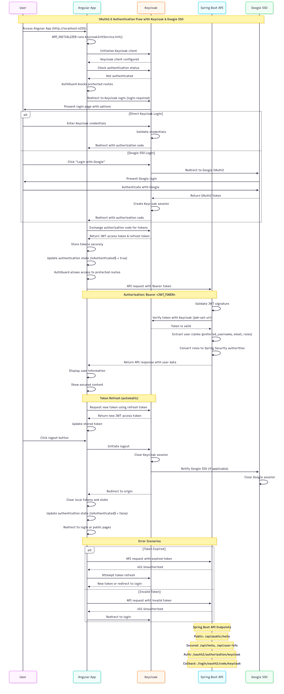

# Secure Hello API Backend


## Overview
A secure Spring Boot REST API that implements OAuth2.0 authentication using Keycloak and Google SSO integration. The application supports both JWT token-based authentication and session-based authentication.

## Authentication flow



## Features
- **Multi-Provider OAuth2 Authentication**: Supports both Keycloak and Google SSO
- **JWT Token Support**: Resource server capabilities for handling JWT tokens
- **Session-based Authentication**: Traditional OAuth2 login flow
- **Role-based Authorization**: Extracts and processes Keycloak roles
- **CORS Configuration**: Configured for Angular frontend integration
- **RESTful API**: Clean REST endpoints with proper security

## Technology Stack
- **Framework**: Spring Boot 3.x
- **Security**: Spring Security OAuth2 Client & Resource Server
- **Authentication**: Keycloak, Google OAuth2
- **Token Format**: JWT
- **Java Version**: 17+

## Prerequisites
- Java 17 or higher
- Maven 3.6+
- Keycloak server running on `http://localhost:8081`
- Keycloak realm: `secure-hello-realm`
- Client configurations in Keycloak

## Configuration

### Keycloak Setup Required
1. **Realm**: `secure-hello-realm`
2. **Client ID**: `secure-hello-client`
3. **Client Secret**: `5kchMPPivusrkFQV91ICxn5UyjJiYwa0`
4. **Valid Redirect URIs**: `http://localhost:8080/login/oauth2/code/keycloak`
5. **Web Origins**: `http://localhost:8080`

### Application Properties
Key configurations in `application.properties`:

```properties
# Server Configuration
server.port=8080

# OAuth2 Client Registration
spring.security.oauth2.client.registration.keycloak.client-id=secure-hello-client
spring.security.oauth2.client.registration.keycloak.client-secret=5kchMPPivusrkFQV91ICxn5UyjJiYwa0
spring.security.oauth2.client.registration.keycloak.scope=openid,profile,email
spring.security.oauth2.client.registration.keycloak.redirect-uri=http://localhost:8080/login/oauth2/code/keycloak

# JWT Resource Server
spring.security.oauth2.resourceserver.jwt.issuer-uri=http://localhost:8081/realms/secure-hello-realm
```

## API Endpoints

### Public Endpoints
- `GET /api/public/hello` - Public hello message (no authentication required)
- `GET /actuator/health` - Health check endpoint

### Secured Endpoints
- `GET /api/hello` - Secured hello message (requires authentication)
- `GET /api/user-info` - Get current user information (requires authentication)

### Authentication Endpoints
- `GET /oauth2/authorization/keycloak` - Initiate Keycloak OAuth2 flow
- `GET /login/oauth2/code/keycloak` - Keycloak OAuth2 callback
- `POST /logout` - Logout endpoint

## Security Features

### JWT Token Support
- Validates JWT tokens from Keycloak
- Extracts user roles from both `realm_access` and `resource_access` claims
- Converts roles to Spring Security authorities with `ROLE_` prefix

### CORS Configuration
- Allows requests from `http://localhost:4200` (Angular) and `http://localhost:3000` (React)
- Supports credentials for session-based authentication
- Configured for all HTTP methods

### Role Extraction
The application extracts roles from JWT tokens:
- **Realm Roles**: From `realm_access.roles`
- **Client Roles**: From `resource_access.{client-id}.roles`

## Running the Application

### 1. Start Keycloak
```bash
# Using Docker
docker run -p 8081:8080 -e KEYCLOAK_ADMIN=admin -e KEYCLOAK_ADMIN_PASSWORD=admin quay.io/keycloak/keycloak:latest start-dev
```

### 2. Configure Keycloak
1. Access Keycloak at `http://localhost:8081`
2. Create realm: `secure-hello-realm`
3. Create client: `secure-hello-client`
4. Configure client settings and obtain client secret

### 3. Start Spring Boot Application
```bash
mvn spring-boot:run
```

The application will start on `http://localhost:8080`

## Testing the API

### Using curl with JWT Token
```bash
# Get JWT token from Keycloak first, then:
curl -H "Authorization: Bearer YOUR_JWT_TOKEN" http://localhost:8080/api/hello
```

### Using Browser (Session-based)
1. Navigate to `http://localhost:8080/api/hello`
2. You'll be redirected to Keycloak login
3. After successful login, you'll see the secured message

## Project Structure
```
src/main/java/com/example/demo/
├── configuration/
│   ├── KeycloakJwtGrantedAuthoritiesConverter.java
│   └── SecurityConfig.java
├── controller/
│   └── HelloController.java
├── bean/
│   ├── HelloResponse.java
│   └── UserInfo.java
└── DemoApplication.java
```

## Key Components

### SecurityConfig
- Configures OAuth2 login and resource server
- Sets up CORS policy
- Defines authorization rules for endpoints

### KeycloakJwtGrantedAuthoritiesConverter
- Extracts roles from JWT tokens
- Converts Keycloak roles to Spring Security authorities

### HelloController
- Handles both JWT and OAuth2 authentication
- Provides user information and hello messages

## Development Notes

### Authentication Flow Support
1. **JWT Token Flow**: For API clients (mobile apps, SPAs with tokens)
2. **OAuth2 Login Flow**: For web applications with sessions

### Error Handling
- Proper exception handling for authentication failures
- CORS preflight request support
- Health check endpoint for monitoring

### Future Enhancements
- Add refresh token support
- Implement user role-based endpoint restrictions
- Add audit logging
- Database integration for user management

## Troubleshooting

### Common Issues
1. **CORS Errors**: Ensure frontend URL is in `corsConfigurationSource()`
2. **JWT Validation Failed**: Check Keycloak realm URL and client configuration
3. **Client Secret Mismatch**: Verify client secret in Keycloak matches application.properties

### Debug Tips
- Enable Spring Security debug logging: `logging.level.org.springframework.security=DEBUG`
- Check Keycloak logs for authentication issues
- Verify JWT token structure using jwt.io

## License
This project is for educational purposes.
