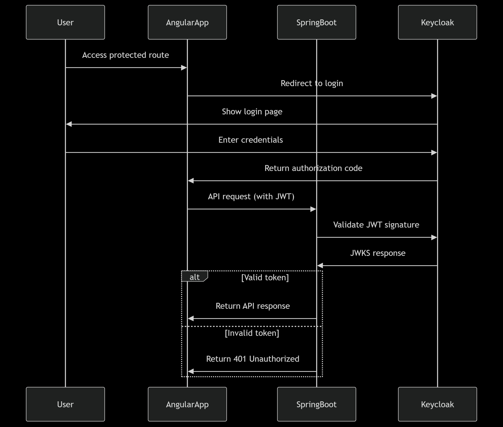

# Secure Hello API Backend


## Overview
Spring Boot application with Keycloak integration providing:
- Public `/api/public/hello` endpoint
- Secured `/api/hello` and `/api/user-info` endpoints
- OAuth2 resource server configuration
- Keycloak JWT role mapping
- CORS configuration for Angular/React apps

  


## Prerequisites
- Java 17+
- Keycloak server running on port 8081
- Maven

## Keycloak Configuration
1. Create realm: `secure-hello-realm`
2. Create client: `secure-hello-client` (confidential)
3. Set valid redirect URI: `http://localhost:8080/login/oauth2/code/keycloak`
4. Configure client secret in `application.properties`

## Installation
```bash
mvn clean install
```

## Running the Application
```bash
mvn spring-boot:run
```

## API Endpoints

Endpoint	Auth Required	Description
GET /api/public/hello	No	Public greeting
GET /api/hello	Yes	Personalized greeting
GET /api/user-info	Yes	User details from JWT

## Configuration
1. Update application.properties:
2.server.port
3.Keycloak issuer URI
4.Client credentials
5.CORS origins

## Dependencies
-Spring Boot Starter Web
-Spring Security
-OAuth2 Resource Server
-Keycloak Spring Adapter
